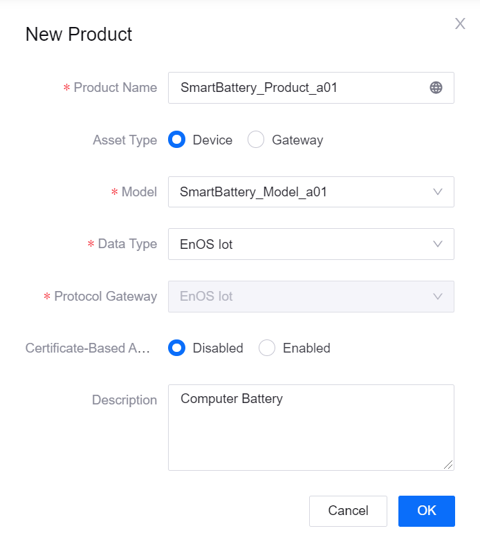
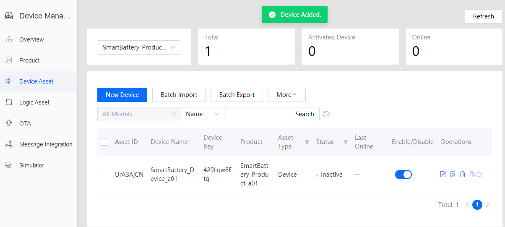

# Lab 1. Connecting a Smart Battery to EnOS (Python)

Before connecting devices to EnOS IoT Hub, you need to register the devices in the EnOS Management Console.

This tutorial will use a smart battery device as an example, and focus on how to register a smart device that connects
directly to the EnOS Cloud.

> **Note**: You will need to replace the configuration name with your own by following the naming pattern: `xxx_studentId`.

## Procedure Overview


## Step 1: Defining a Model

A model is the abstraction of the features of an object that is connected to the IoT Hub. The device model defines the features of a device, including its attributes, measurement points, services, and events.

1. In the EnOS Management Console, click **Models** from the left navigation menu.

2. Click **New Model**, enter the following in the **New Model** window, and click **OK**.
    - Identifier: SmartBattery_Model_a01
    - Model Name: SmartBattery_Model_a01
    - Category: NA
    - Created From: No
    - Source Model: No
    - Description: Model for smart battery a01

    

3. From the list of created model, click **Edit**, and then click the **Feature Definition** tab on the **Model Details** page.

4. Click **Edit > Add > Create Custom Feature**, and create the following custom features in the **Add Feature** window.
    

    Use the following **Point Types** for the corresponding **Measurement Points**.

    | Measurement Point  | Point Type   |
    | ----------------   | ------------ |
    | accumulating_power | AI           |
    | voltage_dq         | AI           |
    | cycle_number       | Generic      |    
    | discharge_energy   | AI           |
    | health_level       | DI           |
    | voltage            | AI           |
    | temp               | AI           |
    | current            | AI           |

## Step 2: Creating a Product

A smart battery product is a collection of battery devices that have the same features. With the model as a base, a product
further defines the communication specifications for the device.

In this step, create a product called **SmartBattery_Product_a01**. We shall assume that a device of this product model sends data in JSON format and that the CA certificate is not used (only secret-based authentication is enforced).

1. In the EnOS Management Console, select **Device Management > Products**.

2. Click **New Product**, enter the following in the **New Product** window, and click **OK**.

    - Product Name: SmartBattery_Product_a01
    - Asset Type: Device
    - Model: SmartBattery_Model_a01
    - Data Type: EnOS IoT
    - Certificate-Based Authentication: Disabled
    - Description: Computer Battery



For details about the configuration of a product, see [Creating a Device Collection (Product)](https://support.envisioniot.com/docs/device-connection/en/latest/howto/device/manage/creating_product.html).

## Step 3: Registering a Device

A device is the instance of a model and belongs to a certain product. It inherits not only the basic features of the product, but also its communication features (the device key-secret pair, and if enabled, device certificate used for secure communication).

In this step, create a device named **SmartBattery_Device_a01**, which belongs to the **SmartBattery_Product_a01** created in
the previous step.

1. In the EnOS Management Console, select **Device Management > Device Assets**.

2. Click **New Device**, enter the following in the **New Device** window, and click **OK**.

    - Product: SmartBattery_Product_a01
    - Device Name: SmartBattery_Device_a01
    - Device Key: Enter the device key
    - Timezone/City: UTC+08:00
    - Use DST: No



## Step 4: Configuring TSDB Storage Policy for Storing Device Data

EnOS Time Series Database (TSDB) provides a variety of storage options for you to store important and frequently-accessed business data. Through configuring storage policies, time-series data can be routed to different datastores based on data types and storage time, thus reducing data storage costs and enhancing data access efficiency.

**Note**:
 - By default, the uploaded data will not stored in TSDB. You must configure data storage policy before the data is uploaded to EnOS Cloud.
 - Each model can be associated to only one storage policy group.

In this step, configure a storage policy for the measurement points that are defined in the **SmartBattery_Model_a01** model.

1. Select **Time Series Data Management > Storage Policy** from the left navigation menu.

2. Click the **+** icon and **Create Group** to create a storage policy group.

   - **Group Name**: Enter a name for the storage policy group.
   - **Group Model**: Search and select the **SmartBattery_Model_a01** model to be associated with the storage policy group.

3. Click **OK** to save the storage policy group configuration.

After the storage group is created, you can see all the TSDB storage policy options listed under the storage group tab. Configure storage policies separately for the above listed measurement points.

Using the **AI Raw Data** storage type as example:

1. Move the cursor on the **AI Raw Data** storage type and click the **Edit** icon to open the **Edit Storage Policy** page.

2. From the **Storage Time** drop down list, select the storage time for the data. For this example, we shall save the data in TSDB for 3 months.

3. Select the **SmartBattery_Model_a01** model and the listed measurement points.

4. Click **OK** to save the storage policy.


## Step 5: Setting Up the Development Environment

After the device modeling, device registration, and data storage policy configuration of the Smart Battery are completed in the EnOS Management Console, you can now use the EnOS Python SDK for MQTT to connect the Smart Battery to EnOS and start transmitting data.

For detailed information about the EnOS Python SDK for MQTT, refer to the readme file on [GitHub](https://github.com/EnvisionIot/enos-device-sdk-python).

EnOS Python SDK for MQTT requires Python3.5.3 or later and pip3. Follow the steps below to set up your development environment.

1. Install Python SDK, which can be downloaded at https://www.python.org/downloads.

2. Install a development environment, such as IntelliJ Pycharm, which can be downloaded at https://www.jetbrains.com/pycharm/download/.

3. Install the **enos-mqtt-sdk-python** sdk module. The latest version of EnOS Device SDK for Python is available in the Python Package Index (PyPi) and can be installed via the below.

    ```python
    pip3 install enos-mqtt-sdk-python
    ```
## Step 6. Programming the Device Connection

After the development environment is set up, follow the steps below to connect the Smart Battery to EnOS Cloud.

1. Declare the variables that will be used in the program. Example:

    ```python
    TCP_SERVER_URL = "tcp://mqtt-ppe1.envisioniot.com:21883" # Obtain the MQTT Broker address from EnOS Console > Help > Environment Information
    PRODUCT_KEY = "yourprodutkey"
    DEVICE_KEY = "yourdevicekey"
    DEVICE_SECRET = "yourdevicesecret"
    ```
    The productKey, deviceKey, and deviceSecret are the device properties generated when you register the Smart Battery.

2. Declare the main function `connect()` for initializing device connection. Example:

    ```python
    if __name__ == '__main__':
        client = MqttClient(TCP_SERVER_URL, PRODUCT_KEY, DEVICE_KEY, DEVICE_SECRET)
        client.get_profile().set_auto_reconnect(True)

        client.connect()  # connect in sync
    ```

3. Use the connect function to connect the Smart Battery to EnOS Cloud. Example:

    ```python
    def on_connect():
        """ Called when the connection to the server is completed."""
        print('connect success')

        client.register_arrived_message_handler(ServiceInvocationCommand.get_class(), service_command_handler)
        print('waiting commands from cloud')


    def on_disconnect():
        """ Called when the client connection lost."""
        print('connect lost')


    def on_connect_failed():
        """ Called when the client connect failed"""
        print('connect failed...')

    if __name__ == '__main__':
        client = MqttClient(TCP_SERVER_URL, PRODUCT_KEY, DEVICE_KEY, DEVICE_SECRET)
        client.get_profile().set_auto_reconnect(True)

        # register connection callback
        client.on_connect = on_connect
        client.on_disconnect = on_disconnect
        client.on_connected_failed = on_connect_failed

        client.connect() # connect in sync
        monitor()
    ```

## Step 7. Uploading Data to EnOS Cloud

After the Smart Battery is connected to EnOS, follow the steps below to simulate the voltage, temperature and currents of the Smart Battery and upload the data to EnOS Cloud.

1. Use the `simulate_measure_points()` function to simulate the voltage, temperature, and current of the Smart Battery. Define all the thresholds at the beginning:
    ```python
    VOL_MAX = 4.5;
    VOL_MIN = 3.8;
    CUR_MAX = 42;
    CUR_MIN = 40;
    TEMP_MIN = 45;
    TEMP_MAX = 75;
    SIMULATE_PERIOD = 10
    ```

2. Code snippet:

    ```python
    # Simulate the measure points of devices
    def simulate_measure_points(number):
        global accumulating_power
        data = {}

        cycle_number = int(number / SIMULATE_PERIOD)
        data["cycle_number"] = cycle_number

        i = number % SIMULATE_PERIOD
        data["temp"] = TEMP_MIN + (TEMP_MAX - TEMP_MIN) * (i + random.random()) / SIMULATE_PERIOD
        data["voltage"] = VOL_MAX - (VOL_MAX - VOL_MIN) * (i + random.random()) / SIMULATE_PERIOD
        data["current"] = CUR_MIN + (CUR_MAX - CUR_MIN) * random.random()

        if (number % SIMULATE_PERIOD == 0):
            accumulating_power = 0
        accumulating_power = accumulating_power + data["voltage"] * data["current"]
        data["accumulating_power"] = accumulating_power

        return data
    ```

3. Use the `post_measure_points()` and `monitor()` function to upload the measurement points of the Smart Battery to EnOS Cloud. See the following code
snippet.

    ```python
    def post_measure_points(data):
        request = MeasurepointPostRequest.builder() \
            .set_timestamp(int(time.time() * 1000))

        for point in data:
            request.add_measurepoint(point, data[point])

        response = client.publish(request.build())
        if response:
            print('measurepoint post response code: {}, {}'.format(response.get_code(), data))

    def monitor():
        i = 0
        while True:
            data = simulate_measure_points(i)
            i += 1

            post_measure_points(data)
            time.sleep(interval)
    ```
## Step 8. Running the Program and Checking the Results

1. Compile and run the program for device connection and data ingestion. Program code example:

    ```python
    import time
    import random

    from enos.core.MqttClient import MqttClient
    from enos.message.upstream.tsl.MeasurepointPostRequest import MeasurepointPostRequest
    from enos.message.downstream.tsl.ServiceInvocationCommand import ServiceInvocationCommand
    from enos.message.downstream.tsl.ServiceInvocationReply import ServiceInvocationReply

    TCP_SERVER_URL = "tcp://mqtt-ppe1.envisioniot.com:21883"
    PRODUCT_KEY = "yourprodutkey"
    DEVICE_KEY = "yourdevicekey"
    DEVICE_SECRET = "yourdevicesecret"

    #
    VOL_MAX = 4.5;
    VOL_MIN = 3.8;
    CUR_MAX = 42;
    CUR_MIN = 40;
    TEMP_MIN = 45;
    TEMP_MAX = 75;
    SIMULATE_PERIOD = 10

    #
    interval = 1
    accumulating_power = 0

    def simulate_measure_points(number):
        global accumulating_power
        data = {}

        cycle_number = int(number / SIMULATE_PERIOD)
        data["cycle_number"] = cycle_number

        i = number % SIMULATE_PERIOD
        data["temp"] = TEMP_MIN + (TEMP_MAX - TEMP_MIN) * (i + random.random()) / SIMULATE_PERIOD
        data["voltage"] = VOL_MAX - (VOL_MAX - VOL_MIN) * (i + random.random()) / SIMULATE_PERIOD
        data["current"] = CUR_MIN + (CUR_MAX - CUR_MIN) * random.random()

        if (number % SIMULATE_PERIOD == 0):
            accumulating_power = 0
        accumulating_power = accumulating_power + data["voltage"] * data["current"]
        data["accumulating_power"] = accumulating_power

        return data

    def post_measure_points(data):
        request = MeasurepointPostRequest.builder() \
            .set_timestamp(int(time.time() * 1000))

        for point in data:
            request.add_measurepoint(point, data[point])

        response = client.publish(request.build())
        if response:
            print('measurepoint post response code: {}, {}'.format(response.get_code(), data))

    def monitor():
        i = 0
        while True:
            data = simulate_measure_points(i)
            i += 1

            post_measure_points(data)
            time.sleep(interval)

    def service_command_handler(arrived_message, arg_list):
        print('receive service invocation command: {}, args: {}'.format(arrived_message, arg_list))
        product_key, device_key, service_name = arg_list
        params = arrived_message.get_params()

        if service_name == 'high_frequency_report_service':
            global interval
            interval = int(params.get('interval'))
            return ServiceInvocationReply.builder() \
                .add_output_data('result', 0) \
                .set_code(200) \
                .build()
        else:
            return ServiceInvocationReply.builder().set_message('unknown service:').set_code(220).build()

    def on_connect():
        """ Called when the connection to the server is completed."""
        print('connect success')

        client.register_arrived_message_handler(ServiceInvocationCommand.get_class(), service_command_handler)
        print('waiting commands from cloud')


    def on_disconnect():
        """ Called when the client connection lost."""
        print('connect lost')


    def on_connect_failed():
        """ Called when the client connect failed"""
        print('connect failed...')

    if __name__ == '__main__':
        client = MqttClient(TCP_SERVER_URL, PRODUCT_KEY, DEVICE_KEY, DEVICE_SECRET)
        client.get_profile().set_auto_reconnect(True)

        # register connection callback
        client.on_connect = on_connect
        client.on_disconnect = on_disconnect
        client.on_connected_failed = on_connect_failed

        client.connect() # connect in sync
        monitor()
    ```

2. Check the running results of the program. The program will return the following sample results.

    ```ssh
    onConnectSuccess
    waiting commands from cloud
    ```

3. Check the running results of program when it posts the measurement points to the cloud:
    ```$xslt
    connect success
    waiting commands from cloud
    measurepoint post response code: 200, {'cycle_number': 0, 'temp': 45.33639481400027, 'voltage': 4.476127173515886, 'current': 40.57236573795417, 'accumulating_power': 181.6070687734816}
    measurepoint post response code: 200, {'cycle_number': 0, 'temp': 50.12095953667547, 'voltage': 4.375110588038265, 'current': 41.808972720876994, 'accumulating_power': 364.5259479995935}
    measurepoint post response code: 200, {'cycle_number': 0, 'temp': 53.70875593556161, 'voltage': 4.3430578089373055, 'current': 40.01262380152207, 'accumulating_power': 538.3030862568646}
    measurepoint post response code: 200, {'cycle_number': 0, 'temp': 56.207075645498826, 'voltage': 4.24141682055193, 'current': 41.34971752375547, 'accumulating_power': 713.6844736871919}
    ```

4. Check the status change of the Smart Battery device in the Device List on the EnOS Management Console. The status of the device will change from Inactive to Online.

    

5. Check the attributes of the Smart Battery device that have been updated under the **Attributes** tab on the **Device Details** page.

    

6. Check the measurement points which are posted to the cloud under the **Measurement Points** tab on the **Device Details** page.

    

## Step 9: Checking the Data Insight of the Device

Go to **Time Series Data Management > Data Insights** and select the **SmartBattery_Device_a01** device to view the real-time current data report in minutes.


## Next Lab

[Simulating Measurement Points](302-2_simulating_measure_points.md)
