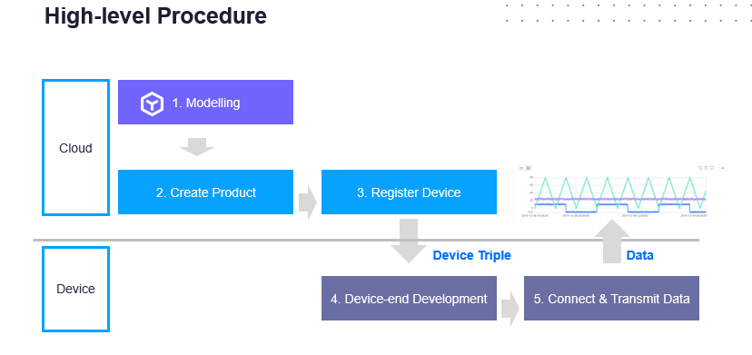
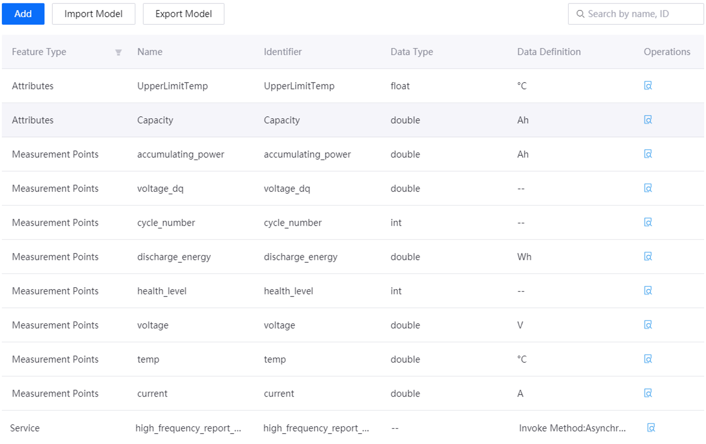

# Lab 1: Connecting the Smart Battery into EnOS

Before connecting devices to EnOS IoT hub, you need to register the devices on the EnOS Console.

This tutorial takes a smart battery device as an example, focusing on how to register a smart device that connects 
directly to the EnOS Cloud.

> **Note** that you'll need to replace the configuration name with your own by following the naming pattern: `xxx_studentId`.

## Procedure Overview



## Step 1: Defining a Model

A model is the abstraction of the features of an object that is connected to IoT hub. The device model defines the features of a device, including attributes, measuring points, services, and events. 

1. In the EnOS Console, click **Model** from the left navigation panel.

2. Click **New Model**, and provide the following settings in the **New Model** window:
    - Identifier: SmartBattery_Model_a01
    - Model Name: SmartBattery_Model_a01
    - Category: NA
    - Created From: No
    - Source Model: No
    - Description: Model for smart battery a01

    

3. From the list of created model, click **Edit**, and then click the **Feature Definition** tab of the **Model Details** screen.

4. Click **Add** and create the following features in the **Add Feature** window:
    
    
## Step 2: Creating a Product

A smart battery product is a collection of battery devices with the same features. On the basis of the device model, a product 
further defines the communication specifications for the device.

In this step, create a product called `Battery_Product`. Assume that a device of this product model sends data in JSON format and that the CA certificate is not used (aka only secret-based authentication is enforced).

1. In the EnOS Console, select **Device Management > Product**.

2. Click New Product, and provide the following settings in the New Product window:

    - _Product Name: SmartBattery_Product_a01_
    - _Asset Type: Device_
    - _Model: SmartBattery_Model_a01_
    - _Data Type: JSON_
    - _Certificate-Based Authentication: Disabled_
    - _Description: Computer Battery_
    
Click **OK** to save the configuration.


For details about the configuration of a product, see Creating a Device Collection (Product).

## Step 3: Registering a Device

A device is the instance of a product. A device is created from a product so that it inherits not only the basic features of the model, but also the communication features of the product (the device key-secret pair, and if enabled, device certificate used for secure communication).

In this step, create a device named `SmartBattery_Device_a01`, which belongs to the `SmartBattery_Product_a01` created in 
the previous step.

1. In the EnOS Console, select **Device Management > Device Asset**.

2. Click **New Device**, and provide the following settings in the **New Device** window:

    - Product: SmartBattery_Product_a01
    - Device Name: SmartBattery_Device_a01
    - Timezone/City: UTC+08:00
    - Use DST: No
    - Device Key: Optional (it can be generated automatically by the system)
    - brand: Enter the brand information of the battery (an attribute defined for the model)
    
 3. Click **OK** to save the configuration.


## Step 4: Setting up Development Environment

After the device modeling, device registration, and data storage policy configuration of the Smart Battery are 
completed on EnOS Console, you can now program with the EnOS Python SDK for MQTT to connect the Smart Battery into EnOS and start transmitting data.

For detailed information about the EnOS Python SDK for MQTT, refer to the readme file on [GitHub](https://github.com/EnvisionIot/enos-device-sdk-python).

EnOS Python SDK for MQTT requires Python3.5.3 or later and pip3. Complete the following steps to set up your development environment:

1. Install Python SDK, which can be downloaded at https://www.python.org/downloads.

2. Install a development environment, such as IntelliJ Pycharm, which can be downloaded at https://www.jetbrains
.com/pycharm/download/.

3. Install `enos-mqtt-sdk-python` sdk module, The latest version of EnOS Device SDK for Python is available in the Python Package Index (PyPi) and can be installed using

    ```python
    pip3 install enos-mqtt-sdk-python
    ```
## Step 5. Programming for Device Connection

After the development environment is set up, take the following steps to connect the Smart Battery into EnOS Cloud:


1. Declare the variables that will be used in the program, see the following example:

    ```python
    TCP_SERVER_URL = "tcp://mqtt-ppe1.envisioniot.com:21883" # Obtain the MQTT Broker address from EnOS Console > Help > Environment Information
    PRODUCT_KEY = "yourprodutkey"
    DEVICE_KEY = "yourdevicekey"
    DEVICE_SECRET = "yourdevicesecret"
    ```
    The productKey, deviceKey, and deviceSecret are the device properties generated when you register the Smart 
    Battery.

2. Declare the main function connect() for initializing device connection. See the following example:

    ```python
    if __name__ == '__main__':
        client = MqttClient(TCP_SERVER_URL, PRODUCT_KEY, DEVICE_KEY, DEVICE_SECRET)
        client.get_profile().set_auto_reconnect(True)

        client.connect()  # connect in sync
    ```

3. Use the connect function to connect the Smart Battery into EnOS Cloud. See the following code snippet:

    ```python
    def on_connect():
        """ Called when the connection to the server is completed."""
        print('connect success')

        client.register_arrived_message_handler(ServiceInvocationCommand.get_class(), service_command_handler)
        print('waiting commands from cloud')


    def on_disconnect():
        """ Called when the client connection lost."""
        print('connect lost')


    def on_connect_failed():
        """ Called when the client connect failed"""
        print('connect failed...')

    if __name__ == '__main__':
        client = MqttClient(TCP_SERVER_URL, PRODUCT_KEY, DEVICE_KEY, DEVICE_SECRET)
        client.get_profile().set_auto_reconnect(True)

        # register connection callback
        client.on_connect = on_connect
        client.on_disconnect = on_disconnect
        client.on_connected_failed = on_connect_failed

        client.connect() # connect in sync
        monitor()
    ```

## Step 6. Programming to Uploading Data into EnOS Cloud
After the Smart Battery is connected into EnOS, take the following steps to simulate the voltage, temperature and 
currents of the Smart Battery and upload the data into EnOS Cloud:

1. Use the `simulate_measure_points()` function to simulate the voltage, temperature and current of the Smart Battery. all 
the thresholds have been defined at the beginning as below:
    ```python
    VOL_MAX = 4.5;
    VOL_MIN = 3.8;
    CUR_MAX = 42;
    CUR_MIN = 40;
    TEMP_MIN = 45;
    TEMP_MAX = 75;
    SIMULATE_PERIOD = 10
    ```

2. See the following code snippet:

    ```python
    # Simulate the measure points of devices
    def simulate_measure_points(number):
        global accumulating_power
        data = {}

        cycle_number = int(number / SIMULATE_PERIOD)
        data["cycle_number"] = cycle_number

        i = number % SIMULATE_PERIOD
        data["temp"] = TEMP_MIN + (TEMP_MAX - TEMP_MIN) * (i + random.random()) / SIMULATE_PERIOD
        data["voltage"] = VOL_MAX - (VOL_MAX - VOL_MIN) * (i + random.random()) / SIMULATE_PERIOD
        data["current"] = CUR_MIN + (CUR_MAX - CUR_MIN) * random.random()

        if (number % SIMULATE_PERIOD == 0):
            accumulating_power = 0
        accumulating_power = accumulating_power + data["voltage"] * data["current"]
        data["accumulating_power"] = accumulating_power

        return data
    ```
    
3. Use the `post_measure_points()` and `monitor()` function to upload the measure points of smart battery to EnOS Cloud. See the following code 
snippet.

    ```python
    def post_measure_points(data):
        request = MeasurepointPostRequest.builder() \
            .set_timestamp(int(time.time() * 1000))

        for point in data:
            request.add_measurepoint(point, data[point])

        response = client.publish(request.build())
        if response:
            print('measurepoint post response code: {}, {}'.format(response.get_code(), data))

    def monitor():
        i = 0
        while True:
            data = simulate_measure_points(i)
            i += 1

            post_measure_points(data)
            time.sleep(interval)
    ```
## Step 7. Running the Program and Checking the Results

1. Compile and run the program for device connection and data ingestion. See the follow example of the program code:

    ```python
    import time
    import random

    from enos.core.MqttClient import MqttClient
    from enos.message.upstream.tsl.MeasurepointPostRequest import MeasurepointPostRequest
    from enos.message.downstream.tsl.ServiceInvocationCommand import ServiceInvocationCommand
    from enos.message.downstream.tsl.ServiceInvocationReply import ServiceInvocationReply

    TCP_SERVER_URL = "tcp://mqtt-ppe1.envisioniot.com:21883"
    PRODUCT_KEY = "yourprodutkey"
    DEVICE_KEY = "yourdevicekey"
    DEVICE_SECRET = "yourdevicesecret"

    #
    VOL_MAX = 4.5;
    VOL_MIN = 3.8;
    CUR_MAX = 42;
    CUR_MIN = 40;
    TEMP_MIN = 45;
    TEMP_MAX = 75;
    SIMULATE_PERIOD = 10

    #
    interval = 1
    accumulating_power = 0

    def simulate_measure_points(number):
        global accumulating_power
        data = {}

        cycle_number = int(number / SIMULATE_PERIOD)
        data["cycle_number"] = cycle_number

        i = number % SIMULATE_PERIOD
        data["temp"] = TEMP_MIN + (TEMP_MAX - TEMP_MIN) * (i + random.random()) / SIMULATE_PERIOD
        data["voltage"] = VOL_MAX - (VOL_MAX - VOL_MIN) * (i + random.random()) / SIMULATE_PERIOD
        data["current"] = CUR_MIN + (CUR_MAX - CUR_MIN) * random.random()

        if (number % SIMULATE_PERIOD == 0):
            accumulating_power = 0
        accumulating_power = accumulating_power + data["voltage"] * data["current"]
        data["accumulating_power"] = accumulating_power

        return data

    def post_measure_points(data):
        request = MeasurepointPostRequest.builder() \
            .set_timestamp(int(time.time() * 1000))

        for point in data:
            request.add_measurepoint(point, data[point])

        response = client.publish(request.build())
        if response:
            print('measurepoint post response code: {}, {}'.format(response.get_code(), data))

    def monitor():
        i = 0
        while True:
            data = simulate_measure_points(i)
            i += 1

            post_measure_points(data)
            time.sleep(interval)

    def service_command_handler(arrived_message, arg_list):
        print('receive service invocation command: {}, args: {}'.format(arrived_message, arg_list))
        product_key, device_key, service_name = arg_list
        params = arrived_message.get_params()

        if service_name == 'high_frequency_report_service':
            global interval
            interval = int(params.get('interval'))
            return ServiceInvocationReply.builder() \
                .add_output_data('result', 0) \
                .set_code(200) \
                .build()
        else:
            return ServiceInvocationReply.builder().set_message('unknown service:').set_code(220).build()

    def on_connect():
        """ Called when the connection to the server is completed."""
        print('connect success')

        client.register_arrived_message_handler(ServiceInvocationCommand.get_class(), service_command_handler)
        print('waiting commands from cloud')


    def on_disconnect():
        """ Called when the client connection lost."""
        print('connect lost')


    def on_connect_failed():
        """ Called when the client connect failed"""
        print('connect failed...')

    if __name__ == '__main__':
        client = MqttClient(TCP_SERVER_URL, PRODUCT_KEY, DEVICE_KEY, DEVICE_SECRET)
        client.get_profile().set_auto_reconnect(True)

        # register connection callback
        client.on_connect = on_connect
        client.on_disconnect = on_disconnect
        client.on_connected_failed = on_connect_failed

        client.connect() # connect in sync
        monitor()
    ```

2. Check the running result of the program. The program will return the following sample result if the device 

    ```ssh
    onConnectSuccess
    waiting commands from cloud
    ```

3. Check the ruuning results of program when it post measure points to cloud:
    ```$xslt
    connect success
    waiting commands from cloud
    measurepoint post response code: 200, {'cycle_number': 0, 'temp': 45.33639481400027, 'voltage': 4.476127173515886, 'current': 40.57236573795417, 'accumulating_power': 181.6070687734816}
    measurepoint post response code: 200, {'cycle_number': 0, 'temp': 50.12095953667547, 'voltage': 4.375110588038265, 'current': 41.808972720876994, 'accumulating_power': 364.5259479995935}
    measurepoint post response code: 200, {'cycle_number': 0, 'temp': 53.70875593556161, 'voltage': 4.3430578089373055, 'current': 40.01262380152207, 'accumulating_power': 538.3030862568646}
    measurepoint post response code: 200, {'cycle_number': 0, 'temp': 56.207075645498826, 'voltage': 4.24141682055193, 'current': 41.34971752375547, 'accumulating_power': 713.6844736871919}
    ```
    
4. Check the status change of the Smart Battery device in the Device List on the EnOS Console. The status of the 
device will change from Inactive to Online.

    

5. Check the attributes of the Smart Battery device that have been updated under the Attributes tab on the Device 
    Details page.

    

6. Check the measuring points which are posted to the Cloud under the Measuring 
Points tab on the Device Details page.

    
    
## Step 8: Configure TSDB Stroage Policy
In **Time Series Data > Storage Policy**, configure storage policy for the simulated smart battery.

1. Select an existing group or create a new group. Click **Edit Group** . Select **test.smart** battery and click **OK** to include the 
smart battery model into the policy group.

2. Click the **Edit** icon for the AI Raw Data bucket. Select **test.smart** battery to include all its measurement points into this policy.

As we defined Real-time Current as the AI type of data when creating the model and this tutorial doesn’t require normalized data, so we store the Real-time Current data into the AI Raw Data bucket.


## Step 9: Check data insight of the device

Wait until enough time later and go to **Time Series Data > Data Insights** . Select device Simulated smart battery Device . View the Real-time Current data report in minute.


## Next Lab

[Simulating Measure Points](302-2_simulating_measure_points.md)

