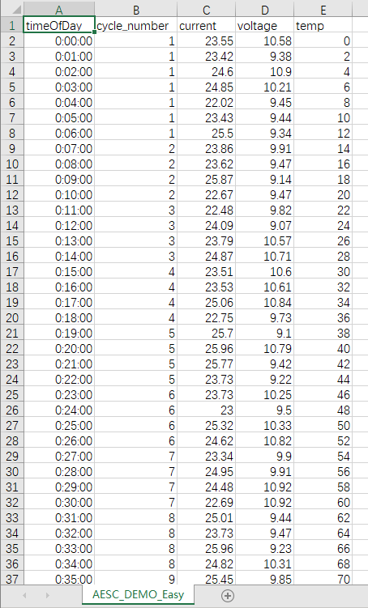
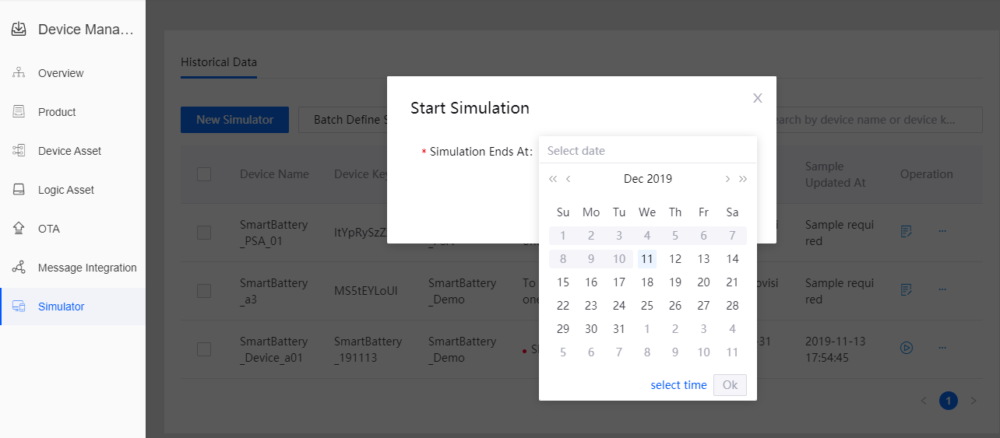

# Lab 2. Simulating Measuring Points

##  Using device simulator
To get started without programing (device-end development), verify features that require data ingestion as the prerequisite, or to troubleshoot issues, you can use the device simulator that EnOS provides.

- Getting started with EnOS: You can leverage this function to simulate a device to transmit data to understand how 
to use the capabilities of EnOS.
- Testing and debugging: During application development, sometimes you need to simulate a device to send a specific value 
to verify device function. Real devices rarely sends that specific value. In this case you can use the device simulator to facilitate application development.

In this tutorial, we simulate a smart battery that sends data to EnOS. We insert some abnormal data into the 
data sample so that we can leverage the data to trigger alerts. Meanwhile, we configure a storage policy to store the data sample in the TSDB and view the data in line chart in **Time Series Data > Data Insights**.

## Before You Start

- You have registered the device to simulate. 
- You have access to device management. If not, contact your OU administrator to grant you the following permissions:
    - Model
    - Device Management
    - Alert
    - Times Series Data

## Step 1: Add a Device Simulator

In **Device Management > Simulator** , create a simulator:

1. Click **Add Simulator**, and select the device to be simulated in this page.

2. The device list shows all the devices that have been created in the current OU. 

> **Note**: You can only simulate a device that is in the **inactive** state. You cannot simulate a device that is already activated and is online or offline.

3. Click **Confirm** to create a simulator for the selected device.

In the list of simulators, you can see the simulator just created. 

Next, you need to define the simulation data sample for it.

## Step 2. Define and upload the simulation data sample. 

1. Find out the simulator just created in the list of simulators, click edit in the operation column.

2. Click **Download** in the pop-up window.

3. Input the simulation data sample in the downloaded template.
    
    - The first column **timeOfDay** refers to the _relative time stamp_: you can enter the relative timestamp within one day (24 hours) in the format of H:MM:SS.    
    - The rest of the column headers are for the names of model points. You only need to enter the identifier of the model point to be simulated rather than entering all model points.     
    - The content under the header are point values. If the data type is array, the format is [value1, value2, value3, …]. Leave the cell empty if there is no value at the current time point.

4. In the pop-up window, click **Upload** to upload the simulation data.

5. Click **Confirm**.

For sample data template using to upload, see [ 
AESC_DEMO_Easy.csv](media/AESC_DEMO_Easy.csv).

When we created the alert rule, we set the alert threshold to 60 milliampere. So in this sample, we need to modify value in column current so that at least one piece of value is above 60 to trigger the alert Current is above threshold .

The best practice is setting some values above 60 at earlier moments so that you don’t have to wait long to see an alert triggered. In this tutorial, the time zone where the author is is UTC+08:00. The time is 10:00 when the author is writing this tutorial. We set abnormal values at 0:02:00, 0:07:00, and 0:10:00, therefore alerts will be triggered at 10:02:00, 10:07:00, and 10:10:00 of the author’s local time.

## Step 3: Start the Device Simulator

You can start simulators one by one or in batch. setting the end time at 24 hours later.

You can actually set the end time whenever you’d like to, but setting it to a later time leaves enough time for TSDB to ingest enough data to generate a report.

## Step 4: Configure TSDB Storage Policy

In **Time Series Data > Storage Policy**, configure storage policy for the simulated smart battery.

1. Select an existing group or create a new group. Click **Edit Group**. Select **test.smart battery** and click **OK** to include the 
smart battery model into the policy group.

2. Click the edit icon in the AI Raw Data bucket. Select **test.smart battery** to include all its measurement points into this policy.

## Step 5: Check out the Data Insights

Wait until enough time later and go to **Time Series Data > Data Insights** . Select device **Simulated smart battery Device**. View the Real-time Current data report in minute.

## Next Lab

[Monitoring Alerts of Smart Battery](302-3_monitoring_alerts_of_device.md)
