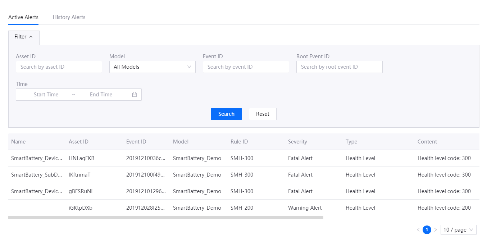

# Lab 3. Monitoring the Alerts of the Smart Battery

An alert is a record generated by the system when the value of a measurement point in a certain domain reaches a specific condition.

The condition that triggers the alert is the alert rule. What is generated by the system is the alert content. As measurement points or alerts may vary, to distinguish and manage the alerts more effectively, alerts on EnOS are typically classified based on the severity (such as danger, critical, error, warning, and information) and type (such as over-limit).

The alert management message flow and the key concepts are illustrated in the following figure.

To monitor the health and performance of your smart battery, you can use the alert severities and alert types which we have defined, so that you will just need to define new alert content and alert rules for any device anomaly. You can use the alert rules below.

- Fatal alert: Temp > 70°C
- Warning alert: 60 °C <Temp<70 °C

## Step 1: Define the Alert Configuration and Triggering Rules
 
 In this lab, we will use alerts to monitor the temperature of the smart battery.

1. In the EnOS Management Console, Click the **Alert** service in the left navigation menu.

    

2.  Click **Alert Type**. The two alert types we will be using are "Telemetering value too high" and "Telemetering value too low".

    

3. In this tutorial, we will define 4 alert content as per the following.
    
    
    Click **Alert Content > New Content** to define the alert content, which can contain the cause of the alert and actions needed from the device owner. Then, associate the battery model and the defined alert type. Repeat the process to create other alert content.

    

4. Click **Alert Rule > New Rule** to define the alert rule for monitoring the battery temperature. 

    
    
5. When the alert rule is saved, it will start running to monitor the temperature of the battery device. You can view 
active alerts and history alerts that are reported for the device at the **Alert > Alert Record** page.

    
    

 ## Step 2: Monitor Alerts from the EnOS Management Console

In **Alert > Alert Records**, select your smart battery model and view the historical alerts. You can see that several alerts have been triggered by the anormal data.

For how to define data sample to trigger alerts, see [Lab 2. Simulating Measurement Points](302-2_simulating_measure_points.md)

   
## Step 3: Obtain Alert Data for Application Use

You can also use the event service APIs to query alert records. For example, you can use the _Search Active Alerts_ API to query active alerts by organization ID and other filtering conditions. For more information about EnOS API, go to **EnOS API** in the EnOS Management Console.

We will walk you through the usage of EnOS APIs in the application development workshop.
