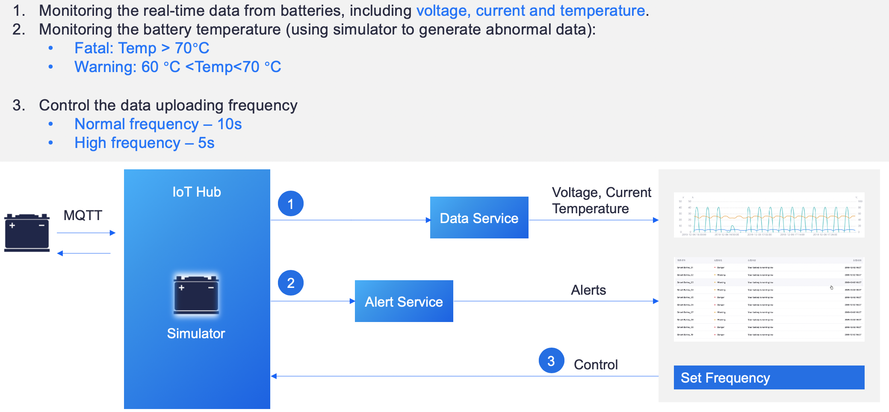

# Device Connectivity & Management Workshop

The first thing you start to do on an IoT platform is to connect your devices and data. This tutorial is the basic learning module you need to complete first.

## Scenario

In the energy industry, monitoring the status of batteries during charging is common business scenario. Temperature 
is an important indicator of the battery status and safety. By connecting the smart battery devices into EnOS, you can ingest the real-time temperature data, configure alert settings to monitor the battery status, and control the state of the battery device.

The scenario is depicted in the following chart:

This tutorial walks you through a typical path of smart battery management, that is:

- Registering & connecting a simulated Smart Battery into EnOS.
- Simulate the battery to post measuring points data using a Java program developed through Java SDK
- Monitoring the alerts of Smart Battery.

## Prerequisites

1. You have signed up to EnOS as an individual account or an enterprise account to access the **EnOS Console**.
2. Your account must have been assigned full access to the model service, device connectivity & management services, and data management services (in the training, this is already done by the trainer).

## Labs

This tutorial includes the following units:

[Lab 1. Connecting the Smart Battery into EnOS (java)](302-1_connecting_device_to_EnOS_cloud.md) 

[Lab 1. Connecting the Smart Battery into EnOS (python)](302-1_connecting_device_to_EnOS_cloud_python.md)

40 minutes

[Lab 2. Simulating Posting Measuring Point of Device](302-2_simulating_measure_points.md)

30 minutes

[Lab 3. Monitoring Alerts of Smart Battery](302-3_monitoring_alerts_of_device.md)

30 minutes

## Related Documentation

https://support.envisioniot.com/docs/device-connection/en/latest/device_management_overview.html
