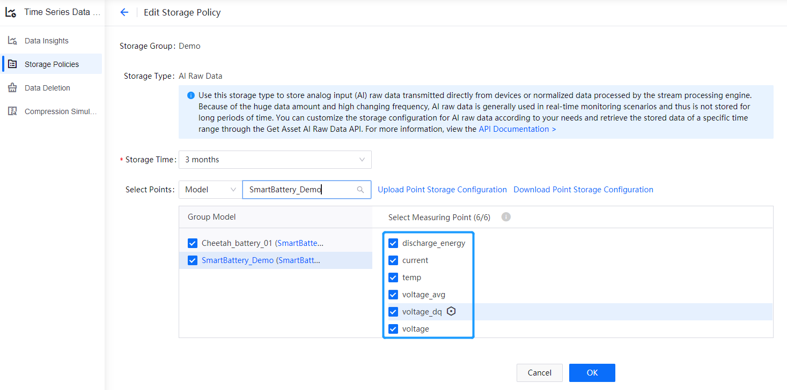
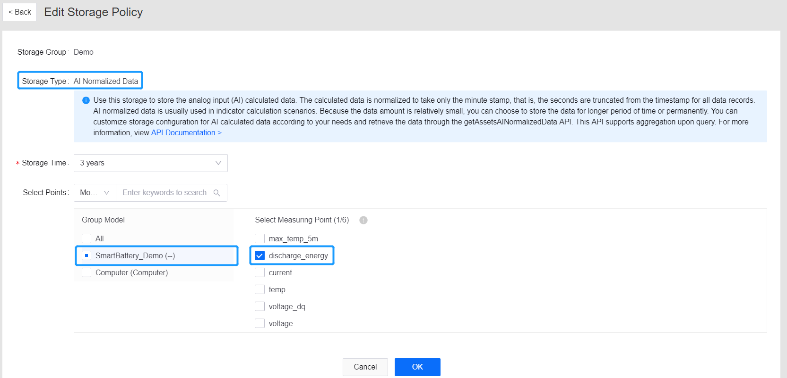
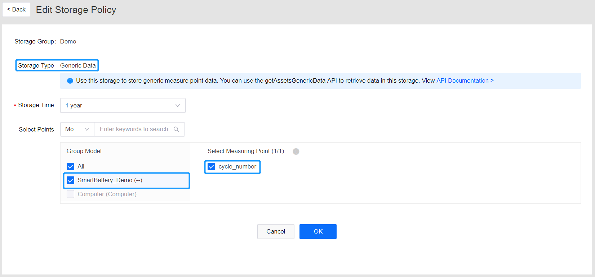

# Lab 1: Configuring Storage Policy for the Battery Data

EnOS Time Series Database (TSDB) provides a variety of storage options for you to store important and frequently-accessed business data. Through configuring storage policies, time-series data can be routed to different datastores based on data types and storage time, thus reducing data storage costs and enhancing data access efficiency.

**Important Notes**: By default, the uploaded data will is not stored in TSDB. You must configure data storage policy before the data is uploaded to EnOS Cloud.

In this lab, configure a storage policy for the following measuring points that are defined in the **SmartBattery_Demo** model.

| Measuring Point  | Storage Type | Description                                                  |
| ---------------- | ------------ | ------------------------------------------------------------ |
| current          | AI Raw Data  | Real-time discharge current of the battery                   |
| voltage          | AI Raw Data  | Real-time voltage of the battery                             |
| temp             | AI Raw Data  | Real-time temperature of the battery                         |
| voltage_dq       | AI Raw Data  | Output point of the stream processing job for measuring the data quality of the battery voltage |
| discharge_energy | AI Raw Data  | Output point of the stream processing job for calculating the discharge energy of the battery |
| health_level     | DI Data      | Output point of the stream processing job for analyzing the health level of the battery |
| cycle_number     | Generic Data | Number of charge-discharge cycles that has happened on the battery                                 |

For detailed description of the supported storage types, see [Configuring TSDB Storage](https://support.envisioniot.com/docs/data-asset/en/latest/configuring_tsdb_storage.html).

## Creating a storage policy group

Storage policy groups enable you to manage the time-series data for different projects separately. Before configuring storage policies for the measuring points, you must create a storage policy group.

However, note that each model can be associated to only one storage policy group.

1. Log into the EnOS Console and select **Time Series Data > Storage Policy** from the left navigation tree.

2. Click **Create Group** or the **+** icon to create a storage policy group. Then, complete the configuration of the storage policy group.

   - **Group Name**: Enter a name for the storage policy group.
   - **Group Model**: Search and select the **SmartBattery_Demo** model to be associated with the storage policy group.

3. Click **OK** to save the storage policy group configuration.

   

## Configuring storage policies

After the storage group is created, you can see all the TSDB storage policy options listed under the storage group tab. Configure storage policies separately for the above listed measuring points.

Taking the **AI Raw Data** storage type as example:

1. Move the cursor on the **AI Raw Data** storage type and click the **Edit** icon to open the **Edit Storage Policy** page.

2. From the **Storage Time** drop down list, select the storage time for the data. In this lab, we'll save the data in TSDB for 3 months.

3. Select the **SmartBattery_Demo** model and the listed measuring points.

4. Click **OK** to save the storage policy.

   

Take the same steps to configure storage policies for other storage types.

For **AI Normalized Data** storage policy, configure as follows:

For **DI Data** storage policy, configure as follows:

For **Generic Data** storage policy, configure as follows:

## Next Lab

[Calculating the Discharge Energy of the Battery](303-2_calculating_discharge_energy.md)

