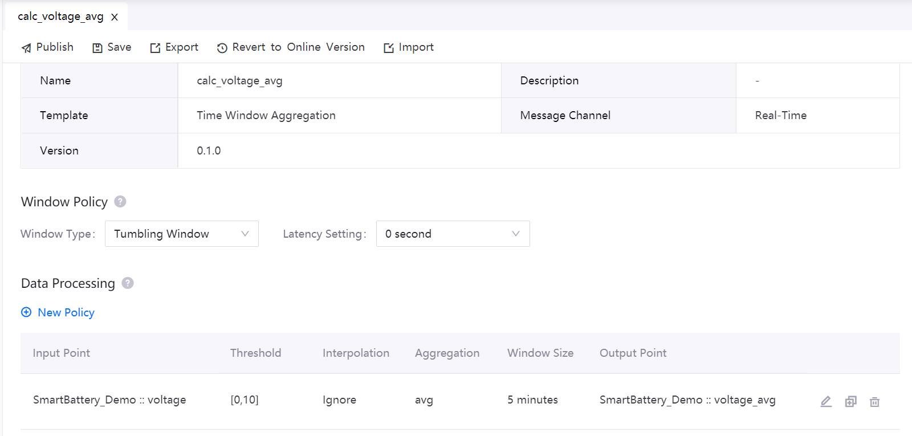
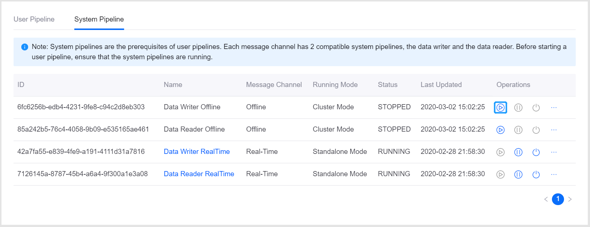
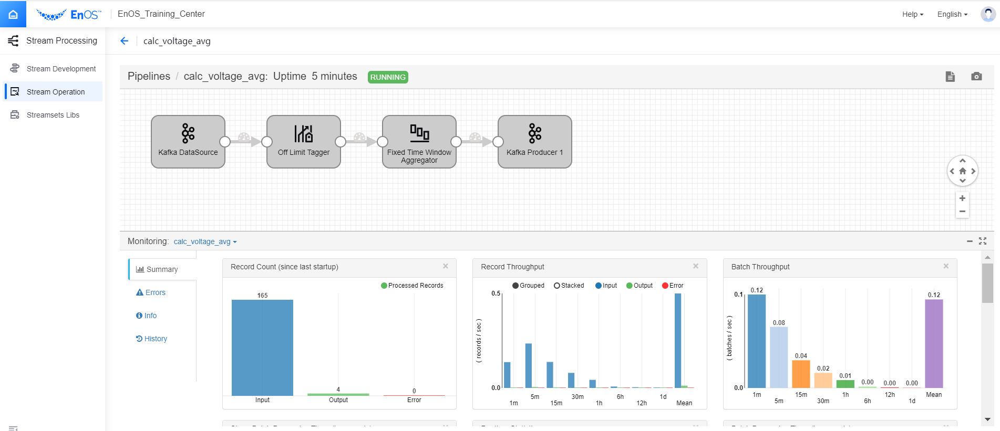
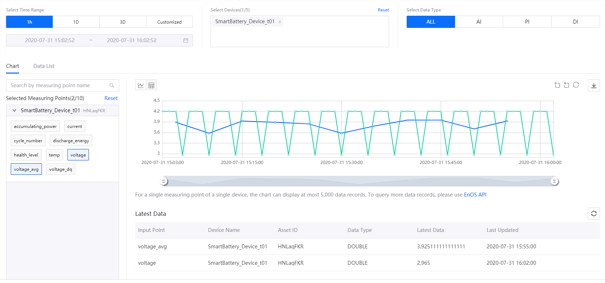

# Lab 2. Calculating the Running-Average of the Battery Voltage

The EnOS Stream Analytics service provides visualized template-based configurations to help you quickly develop stream analytics jobs to process time series data ingested from real-time or offline channels.

After the storage policies are configured for the data uploaded from the battery, we can now develop a stream data processing job to calculate the running-average of the battery voltage. We will use the **Time Window Aggregation** template for the calculation.

The input data, output data, and the template to use for the stream data processing job are as follows:

| Item        | Description                                                  |
| ----------- | ------------------------------------------------------------ |
| Input data  | **voltage**: Battery discharge voltage. |
| Output data | **voltage_avg**: The running-average of the battery discharge voltage. |
| Template to use   | **Time Window Aggregation**: create a stream processing job for aggregating the numeric type data of a single measurement point and assign the processed data to another measurement point on the same device. |

## Step 1: Installing the Data Calculation Templates

If your OU has not installed the Data Calculation Templates, you need first install the templates before you can start.

1. Log in to the EnOS Management Console and click **Stream Processing > Streamsets Libs**.

2. Click the **Template** tab to view the data calculation templates that can be installed. Currently, the following templates are available.

   - Time Window Aggregation: Aggregates numeric data for a single measurement point of a single device.
   - Electric Energy Cal by Meter Reading: Calculates the daily electric energy by meter reading data.
   - Electric Energy Cal by Instant Power: Calculates the daily electric energy by instant power data.
   - Electric Energy Cal by Average Power: Calculates the daily electric energy by average power data.

3. Find the template to be installed and click **Install**. The system will start the installation immediately.

   

 

## Step 2: Creating a Stream Data Processing Job

1. Log in to the EnOS Management Console and click **Stream Data Processing > Stream Development**.
2. Click the **+** icon above the stream processing job list to open the **New Stream** window.
3. For **Method**, select **New** to create a stream data processing job.
5. Enter the name and description of the stream processing job.
6. For **Template**, select **Time Window Aggregation**.
7. For **Version**, select **0.1.0**.
7. For **Message Channel**, select **Real-Time** for processing real-time data that is uploaded to EnOS.

## Step 3: Configuring the Stream Data Processing Job

In the **Window Strategy** section, provide the following.

| Field           | Value           | Description                                                  |
| --------------- | --------------- | ------------------------------------------------------------ |
| Window Type     | Tumbling Window | EnOS stream processing engine currently supports *Tumbling Window* only. |
| Latency Setting | 0 second        | Select the time extension for late/delayed data. If *0 second* is selected, the late/delayed data will not be processed. |

In the **Data Processing** section, click **New Policy** to add an entry for a new data processing policy. Each processing policy will define the input point, output point, threshold, interpolation, window size, and aggregation method.

| Field         | Value                             | Description                                                  |
| ------------- | --------------------------------- | ------------------------------------------------------------ |
| Input Point   | `SmartBattry_Demo :: voltage`     | In the pop-up tab page, select the **SmartBattry_Demo** from the model drop-down list and select **voltage** from the measurement point list. |
| Threshold     | [0, 10]                           | Specify the method and value to filter the input data. Data that exceeds the threshold will be processed by the interpolation algorithm. |
| Interpolation | Ignore                            | Select the interpolation algorithm that is used to revise the input data. Currently, the interpolation algorithm supports *Ignore* only. Data that exceeds the threshold will not be included in the processing. |
| Aggregation   | avg                               | The EnOS streaming processing engine currently supports functions such as `max`, `min`, `avg`, `sum`, and `cnt`. Here, we choose `avg` to calculate and output the average value of all valid record values in the time window. |
| Window Size   | 5 minutes                       | Select a duration for the time window, which will determine the amount of data to be computed in a single window. |
| Output Point  | `SmartBattry_Demo :: voltage_avg` | Select the measurement point to receive the processed results. After the input data is processed, the processed result is transferred to the output point, and an output record is generated. The timestamp of the output record is the start time of the time window. |

See the following example of the completed configuration:

For more information about the *Time Window Aggregation* template, see [Configuring a Time Window Data Aggregation Job](https://support.envisioniot.com/docs/data-asset/en/latest/howto/streaming/configuring_ai_template.html). 

## Step 4: Publishing the Stream Data Processing Job

After the stream data processing job configuration is completed, you can publish it online.

1. Click **Save** to save the configuration of the stream data processing job.

2. Click **Release** to publish the job online.

   

## Step 5: Starting the Stream Data Processing Job

Before starting the stream processing job, make sure that the corresponding system pipelines are started and running. The real-time and offline message channels have 2 system pipelines (data writer and data reader).

Follow the steps below to start the stream processing job.

1. Open the **Stream Operation** page, and check the status of the system pipelines under the **System Pipeline** tab.

2. In the list of system pipelines, click the **Start** icon  to start the required system pipeline. 

   

3. Once the system pipeline has started, you can start your stream processing job. On the **Stream Operation** page, find the data processing job you have published under the **User Pipeline** tab, and click the **Start** icon  to start the job. See the following example:

   

The data processing job will start running if there is no error.

## Step 6: Viewing the Job Running Results

On the **Stream Operation** page, find the running stream data processing job under the **User Pipeline** tab, and click the job name to open the **Stream Details** page. You can view the following information about the job.

- **Summary**: View the summary of the running stream, such as the count of processed data records and the record throughput.

  

- **Log**: Click the **View Logs** icon on the upper right corner to check the running log of the job.

- **Results**: The processed data will be stored in TSDB according to the configured storage policy.

Next, you can go to the **Data Insights** page to view the calculated running-average of the battery voltage.

1. Select **Time Series Data Management > Data Insights** from the left navigation menu to open the **Data Insights** page.
2. In the **Select Time Range** section, select **1h**.
3. Click the **Select Devices** input box, search for your battery device, and select it from the drop-down list. The selected device will be dynamically presented in the **Selected Measuring Points** column for you to select the corresponding measurement points.  
4. In the **Selected Measuring Points** column, click on the selected device name, expand the list of measurement points, and select the **voltage** and **voltage_avg** points. The queried measurement point data will be displayed in the chart on the right.

See the following example of the queried data:

## Next Lab

[Calculating the Health Level of the Battery](303-3_calculating_health_level.md)