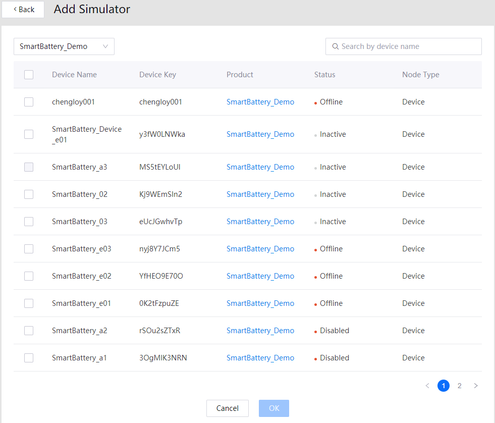
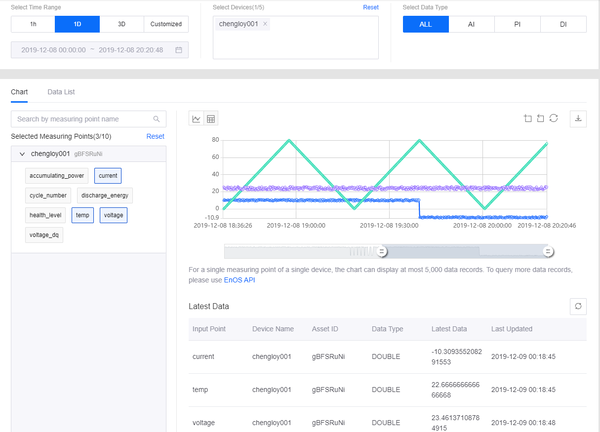

# Lab 2. Simulating Measuring Points

Using device simulator, you can simulate a device that connects to and sends data to EnOS without using the EnOS Java SDK for getting started or troubleshooting. For connecting device by using EnOS Java SDK.

In this tutorial, we simulate a smart battery that sends data to EnOS. We insert some abnormal data into the 
data sample to trigger an alert. Meanwhile, we configure a storage policy to store the data sample in the TSDB and view the data in line chart in Time Series Data > Data Insights .

Before You Start
Obtain access to the following function modules. For more information, see Policy, role, and access:
Model
Device Management
Alert
Times Series Data

Step 4: Launch Device Simulator
In Device Management > Simulator , create a simulator for Simulated Ammeter Device . For information on how to create a simulator, see Using Device Simulator.

Upload data sample for Simulated Ammeter Device . For information on how to upload data sample, see Using Device Simulator](using_device_simulator).

In this sample, there are two columns of data. Column timeOfDay indicates the relative time in a day from 0:00:00 to 23:59:00 in minute. Column current , the identifier for Real-time Current, indicates the measurement point value reported by the device.

When we created the alert rule, we set the alert threshold to 60 milliampere. So in this sample, we need to modify value in column current so that at least one piece of value is above 60 to trigger the alert Current is above threshold .

The best practice is setting some values above 60 at earlier moments so that you don’t have to wait long to see an alert triggered. In this tutorial, the time zone where the author is is UTC+08:00. The time is 10:00 when the author is writing this tutorial. We set abnormal values at 0:02:00, 0:07:00, and 0:10:00, therefore alerts will be triggered at 10:02:00, 10:07:00, and 10:10:00 of the author’s local time.

Start the simulator, setting the end time at 24 hours later.

You can actually set the end time whenever you’d like to, but setting it much later leaves enough time for TSDB to absorb enough data to generate a report.

Results
Data Insights
Wait until enough time later and go to Time Series Data > Data Insights . Select device Simulated Ammeter Device . View the Real-time Current data report in minute.

Alert Record
In Alert > Alert Record, select model Simulated Ammeter Model and view the historical alerts. You can see that several alerts have been triggered by the anormal data.

