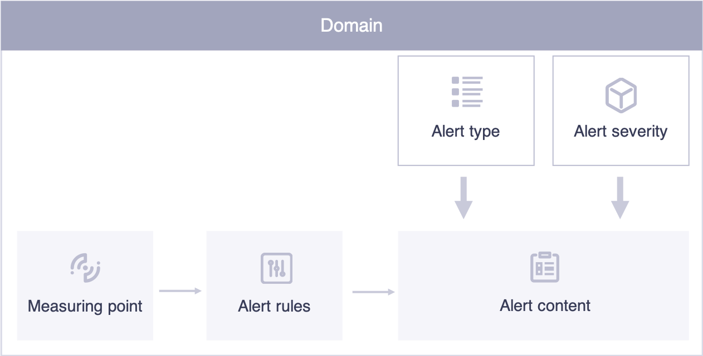

# Lab 3. Monitoring Alerts of Smart Battery
An alert is a record generated by the system when the value of a measuring point in a certain domain reaches a specific condition.

The condition that triggers the alert is the alert rule. What’s generated by the system is the alert content. As measuring points or alerts may vary, to distinguish and manage the alerts more effectively, alerts on EnOS are typically classified based on the severity (such as danger, critical, error, warning, and information) and type (such as over-limit).

The alert management message flow and the key concepts are illustrated in the following figure:

To monitor the health and performance of your smart battery, you can just use the customized alert severities, 
alert 
types which we have defined, and you need just define new alert
 content, and alert rules against any anomaly of the device. 
 
 In this tutorial, we will enable a alerts to monitor the 
 temperature of the smart battery. Detailed steps are as follows:

1. In the EnOS Console, find the Alert service in the left navigation panel.

    

2. Find the Alert type in the left navigation panel, and check the defined an "Telemetering value too high" and 
"Telemetering value too low" alert.
type.

    

3. In this tutorial, we will define 4 alert content, just as blow:
    
    
    Click Alert Content > New Content to define the alert content, which can contain the cause of the alert and actions 
    needed from the device owner. Then, select the battery model and the defined alert type, for example temperature 
    lower than 5°C. and then define other alert content as the same procedure.

    

4. Click Alert Rule > New Rule to define the alert rule for monitoring the battery temperature. For example, Fatal 
Alert, also you should define the Waning Alert as the same.

    
5. When the alert rule is saved, it will start running to monitor the temperature of the battery device. You can view 
active alerts and history alerts that reported against the device on the Alert Record page.

    
   
7. You can also use the event service APIs to query alert records. For example, using the Search Active Alerts API to 
query active alerts by organization ID and other filtering conditions. For more information about EnOS API, go to EnOS Console > EnOS API.
