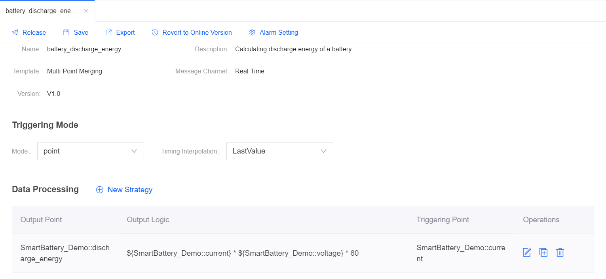
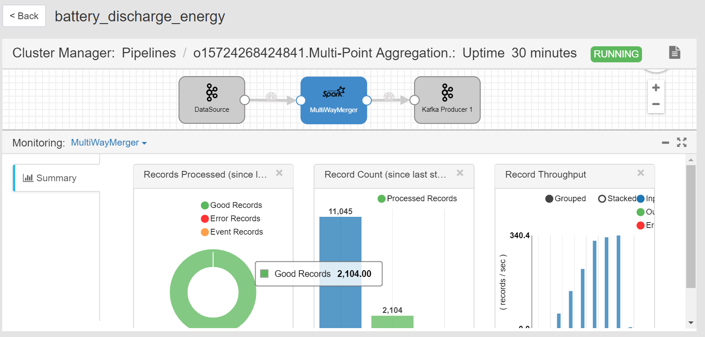
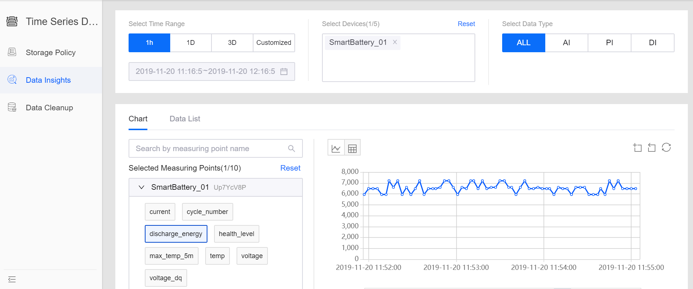

# Lab 2. Calculating the Discharge Energy of the Battery

EnOS Stream Analytics service provides visualized template-based configuration to help you quickly develop stream analytics jobs to process time series data ingested from real-time of offline channels.

After storage policies are configured for the data uploaded from the battery, we can now develop a stream data processing job to calculate the real-time discharge energy of the battery. We will use the **real-time discharge current** and **discharge voltage** to trigger to calculation.

The input data, output data, and the template to use for the stream data processing job are as follows:

| Item        | Description                                                  |
| ----------- | ------------------------------------------------------------ |
| Input data  | Input data used for calculation includes:<ul><li>**current**: Real-time discharge current of the battery</li><li>**voltage**: discharge voltage</li><li>**time interval**: Duration to calculate the discharge energy of the battery (using 60 seconds in this lab)</li></ul> |
| Output data | **discharge_energy**: The measuring point to carry the calculation result: discharge energy of the battery |
| Template to use   | **Multi-Point Merging**: calculate results from multiple measuring points based on scripted calculation expressions, assigns the result to another measuring point on the same device. |

## Creating a stream data processing job

Take the following steps to create a stream data processing job:

1. Log in EnOS Console and click **Stream Data Processing** > **Stream Development**.
2. Click the **+** icon above the stream processing job list to open the **New Stream** window.
3. For **Method**, select **New** to create a stream data processing job.
4. For **Message Channel**, select **Real-Time** for processing real-time data that is uploaded to EnOS.
5. Enter the name and description of the stream processing job.
6. For **Template**, select **Multi-Point Merging**.
7. For **Version**, select **V1.0**.

See the following example:

## Configuring the stream data processing job

In this step, configure the created stream data processing job.

For the **Triggering Mode** section, complete the following settings:

| Field                | Value     | Description                                                  |
| -------------------- | --------- | ------------------------------------------------------------ |
| Triggering Mode      | Point     | The stream data processing job is triggered by the arriving of the specified input point. |
| Timing Interpolation | LastValue | If the data of a measuring point does not arrive when the data processing job is triggered, the last data record of the measuring point will be used for calculation. |

For the **Data Processing** section, click **New Strategy** and complete the following settings in the pop-up window:

| Field            | Value                                                        | Description                                                  |
| ---------------- | ------------------------------------------------------------ | ------------------------------------------------------------ |
| Output Point     | SmartBattry_Demo :: discharge_energy                         | From the model drop-down list, select the **SmartBattry_Demo** model; from the output point drop-down list, select the **discharge_energy** point. |
| Triggering Point | current                                                      | Because the real-time current data of the battery changes during discharge, use the current data as the triggering point. |
| Output Logic     | ``${SmartBattery_Demo::current} * ${SmartBattery_Demo::voltage} * 60`` | The expression for calculating the discharge energy of the battery in every 60 seconds. After entering the expression, click **Check Syntax** to validate the syntax grammar of the expression. |

See the following example:

See the following example of the completed configuration:

For more information about the *Multi-Point Merging* template, see [Configuring a Multi-Point Data Calculation Job](https://support-cn5.envisioniot.com/docs/data-asset/en/latest/howto/stream/configuring_multi_point_template.html).

## Starting the stream data processing job

After the stream data processing job configuration is completed, you can publish it online:

1. Click **Save** to save the configuration of the stream data processing job.

2. Click **Release** to publish the job online.

   

3. On the **Stream Operation** page, find the data processing job that is online, and then click the **Start** icon  to start the job. See the following example:

The data processing job will start running if there is no error.

## Viewing the job running results

On the **Stream Operation** page, find the running stream data processing job in the table, and click the job name to open the **Stream Details** page. You can view the following information about the job:

- **Summary**: View the summary of the running stream, such as the count of processed data records and the record throughput.

  

- **Log**: Click the **View Logs** icon on the upper right corner to check the running log of the job.

- **Results**: The processed data will be stored in TSDB according to the configured storage policy.

Then, you can go to the **Data Insights** page to view the calculated discharge energy data of the battery.

1. Select **Time Series Data > Data Insights** from the left navigation panel of EnOS Console to open the Data Insights page.
2. In the **Select Time Range** section, select **1H**.
3. Click the **Select Devices** input box, search for your battery device, and select it from the drop-down list. The selected device will be dynamically presented in the **Selected Measuring Points** column for selecting corresponding measuring points.  
4. In the **Selected Measuring Points** column, click on the selected device name, expand the list of measuring points, and select the **discharge_energy** point. The queried measuring point data will be displayed in the chart on the right.

See the following example of the queried data:

## Next Lab

[Calculating the Health Level of the Battery](303-3 calculating_health_level.md)
