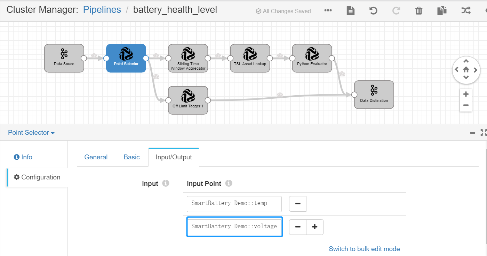
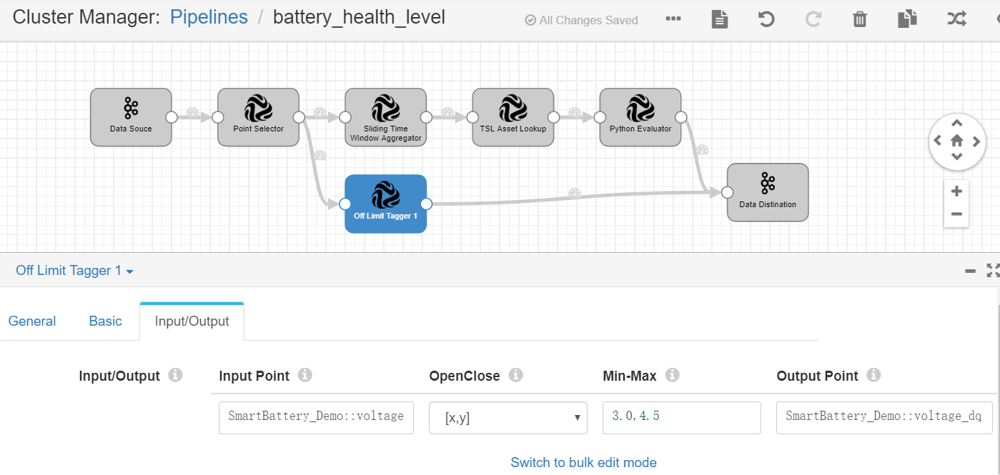

# Lab 5. Generating Data Quality Report

EnOS Data Asset Management service supports evaluating data quality from multiple dimensions (completeness, accuracy, and timeliness of data). By tagging data records with quality index when processing stream data with StreamSets operators, we can generate data quality reports to effectively evaluate the quality of ingested data.

As we know, the voltage of the battery will stay in a certain range without big changes during discharge. In this lab, we will update the stream data processing pipeline created in [Lab 3](303-3 calculating_health_level.md) to filter the voltage data of the battery by the **Off Limit Tagger** operator. Voltage data that exceeds the threshold will be tagged with quality index. With the quality tagging, we can generate data quality report to monitor the accuracy of the ingested voltage data .

## Updating the StreamSets pipeline

Take the following steps to update the StreamSets pipeline created in [Lab 3](303-3 calculating_health_level.md) to add the **Off Limit Tagger** operator:

1. Select **Stream Data Processing > StreamSets** from the left navigation panel of EnOS Console.

2. Find the **battery_health_level** pipeline and click the pipeline name to open the editing page.

3. Before editing the pipeline, back up the pipeline configuration by selecting **... > Export** in the tool bar.

   

4. From the list of operators, click the **Off Limit Tagger** operator to add it to the pipeline canvas.

5. Connect the output point of the **Point Selector** operator to the input point of the **Off Limit Tagger** operator; and connect the output point of the **Off Limit Tagger** operator to the input point of the **Data Destination** operator.

   

6. Click the **Auto Arrange** icon  to align the display of operators in the pipeline.

## Configuring operator parameter

After the pipeline is updated, we need to update the parameter configuration of the **Point Selector** operator and configure the parameters of the **Off Limit Tagger** operator.

### Point Selector

Update the configuration of **Input/Output** by adding the following input point:

| Field       | Value                      | Description                                              |
| ----------- | -------------------------- | -------------------------------------------------------- |
| Input Point | SmartBattery_Demo::voltage | Getting the `voltage` point data from Kafka as the input |

See the following example:

### Off Limit Tagger

Complete the configuration of **Input/Output** with the following settings:

| Field        | Value                         | Description                                                  |
| ------------ | ----------------------------- | ------------------------------------------------------------ |
| Input Point  | SmartBattery_Demo::voltage    | Specifying the `voltage` point data as the input             |
| OpenClose    | [x,y]                         | Specifying the format of the threshold                       |
| Min-Max      | 3.0,4.5                       | Specifying the lower limit value and upper limit value of the threshold |
| Output Point | SmartBattery_Demo::voltage_dq | Specifying the point that receives the data quality output results |

See the following example:

## Validating and running the pipeline

When the configuration of the operators is completed, we can now validate the configuration and start running the pipeline.

For detailed steps, refer to the *Validating and running the pipeline* section in [Lab 3](303-3 calculating_health_level.md).

## Generating data quality report

When the updated StreamSets pipeline is running for a while, we can now view the quality of the battery voltage data by generating a data quality report.

1. Select **Data Quality** from the left navigation panel of EnOS Console.

2. Set filtering conditions to generate data quality report:

   - **Model**

     Select the **SmartBattery_Demo** model from the drop-down list.

   - **Measuring Point**

     Select the **voltage_dq** measuring point from the drop-down list.

   - **Asset**

     Click in the field and select one or more assets to generate data quality report for.

   - **Time**

     Select or specify the time range to query data quality information.  

3. Click the **Query** button to generate data quality report. See the following example:

   

## Next Lab

[Archiving Uploaded Data of the Battery](303-6 archiving_data.md)

