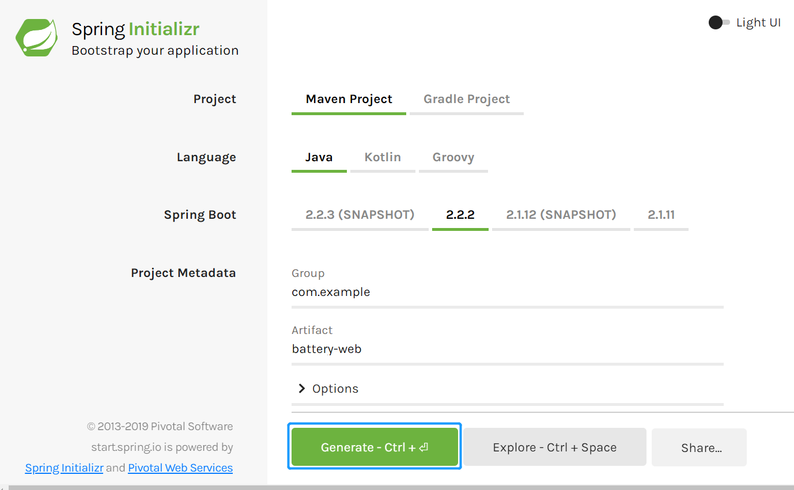
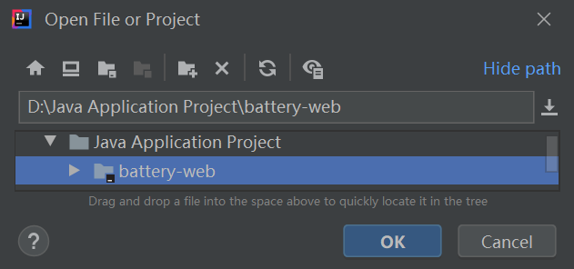
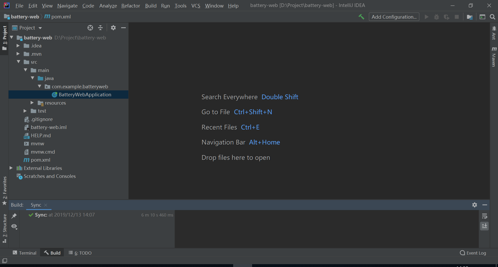
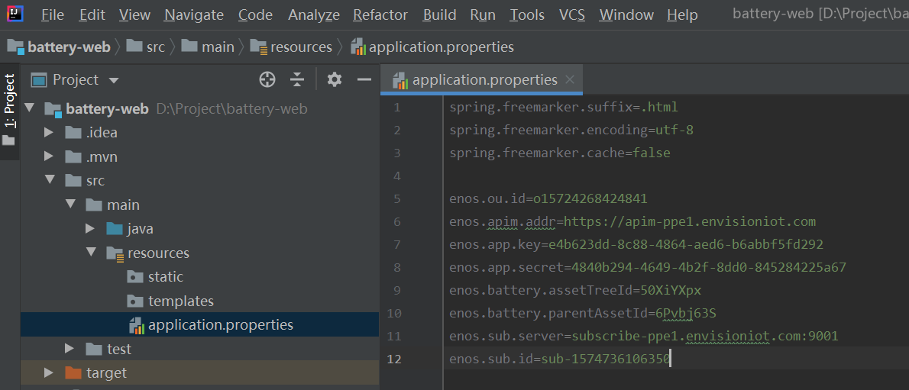
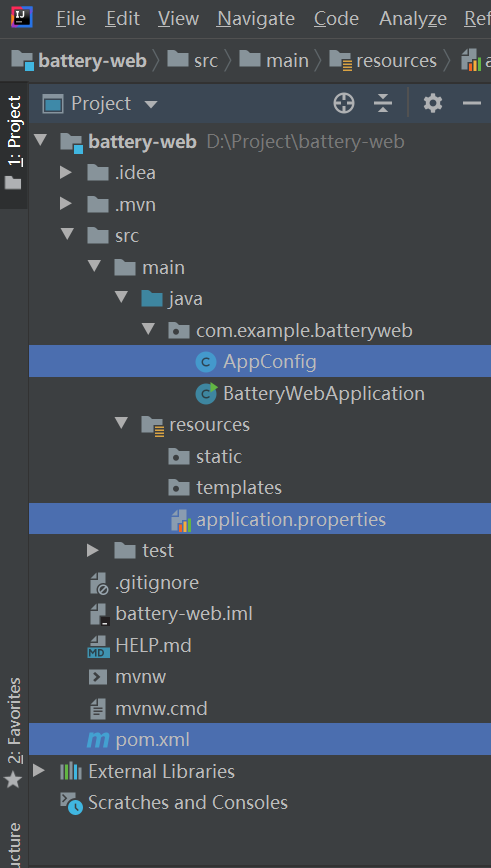

# Creating a Web Project

In this unit, we will create a Java Springboot web project for developing the application and add maven dependencies for the EnOS Java Core SDK.

## Creating a project

To save the effort of creating a project from scratch, we can create a project by importing the project configuration package. 

Take the following steps to create a Springboot web project:

1. Open the [Spring Initializr](https://start.spring.io/#!type=maven-project&language=java&platformVersion=2.2.2.RELEASE&packaging=jar&jvmVersion=1.8&groupId=com.example&artifactId=battery-web&name=battery-web&description=demo%20project%20for%20spring%20boot&packageName=com.example.battery-web&dependencies=devtools,lombok,web,freemarker) site with the configured `battery-web` project information.

2. Click the **Generate** button to download the project configuration package `battery-web.zip`.

   

3. Extract the `battery-web.zip` file to the current directory.

4. Open the IntelliJ IDEA Community Edition and select **File > Open** from the menu.

5. On the **Open File or Project** window, browse and select the extracted project folder, and click **OK**.

   

6. Open the project in a new window.

   

7. Wait for the dependencies to be downloaded. 

   

8. When the dependencies are all downloaded, a Java Springboot web application project is created.

   


## Adding Maven dependency of EnOS SDK

After the project is created, we need to add Maven dependency of EnOS Java Core SDK, which is required for invoking EnOS APIs.

1. From the left navigation bar of the project space, double click the `pom.xml` file to open it.

   

2. In the `pom.xml` file, find the `</dependencies> ` line, and insert the the following dependencies before it:

   ```
           <dependency>
               <groupId>org.springframework.boot</groupId>
               <artifactId>spring-boot-starter-websocket</artifactId>
           </dependency>
           <dependency>
               <groupId>com.envisioniot</groupId>
               <artifactId>enos-dm-api-pojo</artifactId>
               <version>0.2.5</version>
           </dependency>
           <dependency>
               <groupId>com.envisioniot</groupId>
               <artifactId>enos-subscribe</artifactId>
               <version>2.3.0</version>
           </dependency>
           <dependency>
               <groupId>log4j</groupId>
               <artifactId>log4j</artifactId>
               <version>1.2.16</version>
           </dependency>
           <dependency>
               <groupId>junit</groupId>
               <artifactId>junit</artifactId>
           </dependency>
   ```
   
3. In the lower-right corner, a hint of "Maven projects need to be imported" will be displayed. Click **Import Changes** to import the maven dependencies.

   

4. Wait for the dependencies to be downloaded. 

When the synchronization is completed, the Maven dependency of EnOS SDK is added.


## Configuring application properties

In this step, configure the application properties file with the following values:

1. Open the `src/main/resources/application.properties` file, and enter the following values:

   ```
   spring.freemarker.suffix=.html
   spring.freemarker.encoding=utf-8
   spring.freemarker.cache=false
   
   enos.ou.id=o15724268424841
   enos.apim.addr=https://apim-ppe1.envisioniot.com
   enos.app.key=e4b623dd-8c88-4864-aed6-b6abbf5fd292
   enos.app.secret=4840b294-4649-4b2f-8dd0-845284225a67
   enos.battery.assetTreeId=50XiYXpx
   enos.battery.parentAssetId=6Pvbj63S
   enos.sub.server=subscribe-ppe1.envisioniot.com:9001
   enos.sub.id=sub-1574736106350
   ```

   Description to the properties is as follows:

   | Properties                 | Description                                                  |
   | -------------------------- | ------------------------------------------------------------ |
   | enos.ou.id                 | ID of the organization on EnOS Console. For the **EnOS_Training_Center** OU, keep the value in the above sample. |
   | enos.apim.addr             | EnOS API gateway address. For the **EnOS_Training_Center** OU, keep the value in the above sample. |
   | enos.app.key               | Access Key of the application SA. For the **SmartBattery_Demo** application, keep the value in the above sample. |
   | enos.app.secret            | Secret Key of the application SA.                            |
   | enos.battery.assetTreeId   | ID of the asset tree for the battery devices. For the **Envision Smart Battery Provider** asset tree, keep the value in the above sample. |
   | enos.battery.parentAssetId | Asset ID of the parent node of batteries on the asset tree, which is used for querying list of batteries under a specific asset tree node. Replace the value with the asset ID of a node on the created asset tree. |
   | enos.sub.server            | Data subscription server address. For the **EnOS_Training_Center** OU, keep the value in the above sample. |
   | enos.sub.id                | ID of the data subscription job. Replace the value with the ID of your data subscription job. |

   See the following screen capture:

   

   

2. Open the `src/main/java/com.example.batteryweb` directory, and click **File > New > Java Class** from the menu to create a class named `AppConfig` for reading and writing in the properties file.

   

3. In the created `AppConfig` class, enter the following code:

   ```java
   package com.example.batteryweb;
   
   import org.springframework.beans.factory.annotation.Value;
   import org.springframework.stereotype.Component;
   
   @Component
   public class AppConfig {
       @Value("${enos.apim.addr}")
       public String addr;
   
       @Value("${enos.app.key}")
       public String accessKey;
   
       @Value("${enos.app.secret}")
       public String accessSecret;
   
       @Value("${enos.ou.id}")
       public String orgId;
   
       @Value("${enos.battery.assetTreeId}")
       public String assetTreeId;
   
       @Value("${enos.battery.parentAssetId}")
       public String parentAssetId;
   
       @Value("${enos.sub.server}")
       public String subServer;
   
       @Value("${enos.sub.id}")
       public String subId;
   }
   ```

Now, the parameter configuration for the application development is completed. See the following screen capture. 




## Testing the configured parameters

In this step, test the configured parameters with a unit test.

1. Open the `src/test/java/com.example.batteryweb` directory and create a class named `AppConfigTests`.

2. In the created `AppConfigTests` class, enter the following code:

   ```java
   package com.example.batteryweb;
   
   import org.junit.jupiter.api.Test;
   import org.springframework.beans.factory.annotation.Autowired;
   import org.springframework.boot.test.context.SpringBootTest;
   
   @SpringBootTest
   public class AppConfigTests {
       @Autowired
       private AppConfig config;
   
       @Test
       void testAppConfig() {
           System.out.println("enos.apim.addr = "+ config.addr);
           System.out.println("enos.app.accessKeyr = "+ config.accessKey);
           System.out.println("enos.app.secretr = "+ config.accessSecret);
       }
   }
   ```

3. Click the **Run Test** icon next to `testAppConfig()` and select **Run 'testAppConfig()'** to run the unit test.

   

4. Check the results of the unit test. See the following example.

   

5. (Optional) Add more lines in `testAppConfig()` to test reading data of other configured parameters.


## Adding the Front End

After we have completed the configuration of the web application, we can add the front end of the application for displaying the queried battery data.

In this step, extract the provided front-end package into the Java web project by the following steps:

1. Download the front-end package `Front_End.zip` from https://github.com/EnvisionIot/developer_bootcamp/tree/master/App_Front_End.

2. Extract the front-end package to the `resources` directory of the Java web project. Ensure that the `static` directory, `templates` directory, and the `application.properties` file are under the same directory. The directory structure is as follows:

   ```shell
   ├── src
   │   ├── main
   │   │   ├── java/
   │   │   └── resources/
   │   │       ├── application.properties
   │   │       ├── static/
   │   │       └── templates/
   ```

3. Open the `controller` package, create a class named `BatteryController`, and enter the following code for developing a front-end page:

   ```
   package com.example.batteryweb.controller;
   
   import lombok.extern.slf4j.Slf4j;
   import org.springframework.stereotype.Controller;
   import org.springframework.web.bind.annotation.RequestMapping;
   
   import javax.servlet.http.HttpServletRequest;
   import java.util.Map;
   
   @Controller
   @Slf4j
   public class BatteryController {
       @RequestMapping("/")
       public String chat(HttpServletRequest request, Map<String, String> data) {
           return "battery";
       }
   }
   ```

4. Open a browser and enter `http://127.0.0.1:8080` in the address field. View the displaying result of the application. See the following example:

   

Now, as shown in the above picture, no data is displayed.

In the next step, we will try calling EnOS APIs to get the following battery data step by step:

- Get the battery asset list
- Get battery asset information
- Get the battery status (health level and remaining power)
- Get the asset alert records
- Set battery data uploading frequency
- Get the dynamic data of batteries: real-time voltage, current, and temperature

## Next Unit

[Invoking EnOS APIs](invoking_api_java.md)