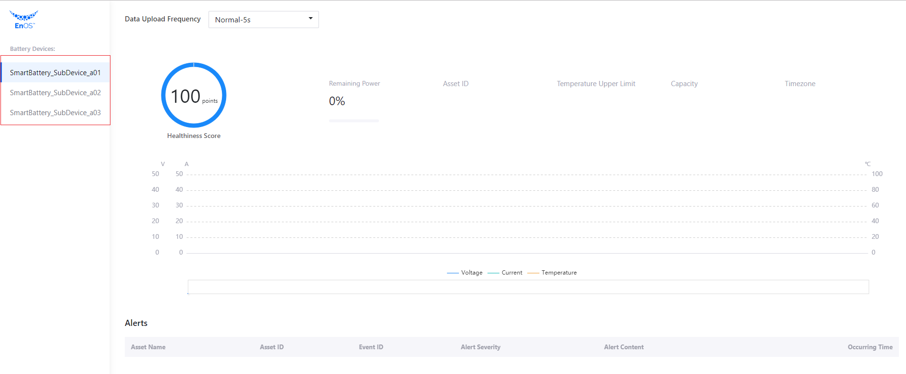
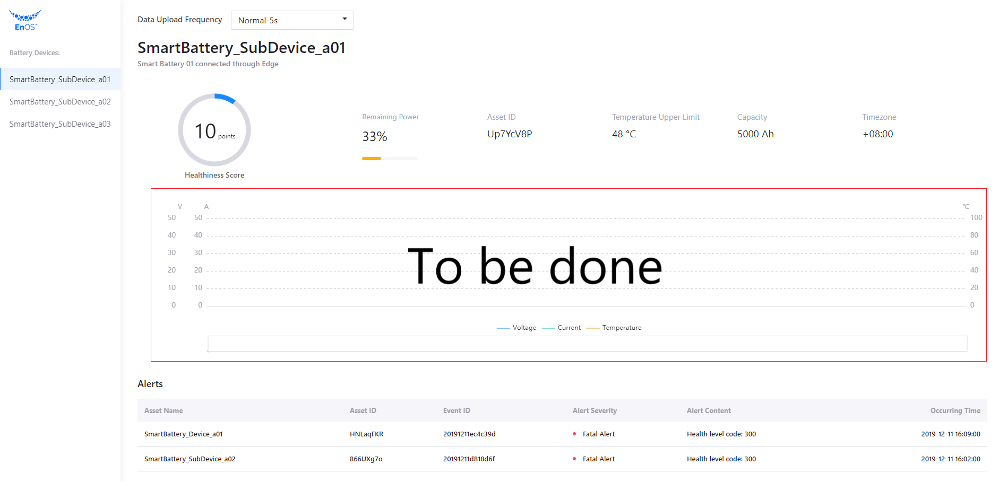

# Invoking EnOS APIs

In this unit, we can start to invoke EnOS APIs to get the asset information of batteries and the ingested history data of batteries stored in TSDB.

## Getting battery asset list

> In this step, we will invoke the EnOS API *Search Related Asset Node*. The request format is:
>
> https://{apigw-address}/asset-tree-service/v2.1/asset-nodes?action=searchRelatedAsset

Take the following steps to invoke the EnOS API to get the battery asset list from the asset tree:

1. From the left navigation bar of the project space, open the `src/main/java/com.example.batteryweb` directory, and click **File > New > Package** from the menu to create 3 packages named `service`, `controller`, and `model` for storing functional classes.

   

2. Open the `service` package, create a class named `DataService`, and enter the following code for getting the list of assets of specified models and asset tree:

   ```java
   package com.example.batteryweb.service;
   
   import com.envision.apim.poseidon.config.PConfig;
   import com.envision.apim.poseidon.core.Poseidon;
   import com.envision.apim.poseidon.exception.PoseidonException;
   import com.envision.apim.poseidon.request.IPoseidonRequest;
   import com.envisioniot.enos.asset_tree_service.v2_1.SearchRelatedAssetNodeRequest;
   import com.envisioniot.enos.asset_tree_service.v2_1.SearchRelatedAssetNodeResponse;
   import com.envisioniot.enos.asset_tree_service.vo.RelatedAssetSearchVo;
   import com.example.batteryweb.AppConfig;
   import lombok.extern.slf4j.Slf4j;
   import org.springframework.beans.factory.annotation.Autowired;
   import org.springframework.stereotype.Component;
   
   import java.util.ArrayList;
   import java.util.List;
   
   @Component
   @Slf4j
   public class DataService {
       @Autowired
       AppConfig config;
   
       public <T> T getResponse(IPoseidonRequest request, Class<T> cls) throws PoseidonException {
           return Poseidon.config(PConfig.init().appKey(config.accessKey).appSecret(config.accessSecret)).url(config.addr).getResponse(request, cls);
       }
   
       /**
        * Getting the list of assets of specified models and asset tree.
        * @return SearchRelatedAssetNodeResponse
        */
       public SearchRelatedAssetNodeResponse getAssetList() {
           SearchRelatedAssetNodeRequest request= new SearchRelatedAssetNodeRequest();
           request.setOrgId(config.orgId);
           request.setTreeId(config.assetTreeId);
   
           RelatedAssetSearchVo filter = new RelatedAssetSearchVo();
           filter.setIsChildOfAssetId(config.parentAssetId);
           request.setFilter(filter);
   
           return getResponse(request, SearchRelatedAssetNodeResponse.class);
       }
   }
   ```
   
3. Open the `controller` package, create a class named `DataController`, and enter the following code for displaying the queried list of assets as JSON data in browsers:

   ```
   package com.example.batteryweb.controller;
   
   import com.envisioniot.enos.asset_tree_service.v2_1.SearchRelatedAssetNodeResponse;
   import com.envisioniot.enos.asset_tree_service.vo.AssetVo;
   import com.example.batteryweb.service.DataService;
   import lombok.extern.slf4j.Slf4j;
   import org.springframework.beans.factory.annotation.Autowired;
   import org.springframework.web.bind.annotation.*;
   
   import java.util.*;
   
   @RestController
   @Slf4j
   public class DataController {
       @Autowired
       private DataService dataService;
   
       /**
        * Returning all the battery assets under the "Envision Smart Car Factory" asset tree.
        * @return
        */
       @RequestMapping("/battery/list")
       public Map<String, Object> list() {
   
           SearchRelatedAssetNodeResponse resp = dataService.getAssetList();
   
           List<Map<String, String>> batteries=new ArrayList();
           for (AssetVo asert: resp.getData()) {
               Map<String, String> item = new HashMap<>();
               item.put("assetId", asert.getAssetId());
               item.put("name", asert.getName().getDefaultValue());
               batteries.add(item);
           }
   
           // Ordering the display of batteries
           Collections.sort(batteries, new Comparator<Map<String,String>>() {
               @Override
               public int compare(Map<String, String> o1,
                                  Map<String, String> o2) {
                   return o1.get("name").compareTo(o2.get("name"));
               }
           });
   
           Map<String, Object> result = new HashMap<>();
           result.put("batteries", batteries);
           return result;
       }
   }
   ```


With the programming work completed, we can now test running the code.

1. Open the `src/main/java/com.example.batteryweb` directory, double click the `BatteryWebApplication` class to open it.

2. Click **Run 'BatteryWebApplication'** to start the application.

   

3. Open a browser and enter `http://127.0.0.1:8080` in the address field. Check the queried list of battery assets. See the following example:

   

## Getting asset information of a specific battery

> In this step, we will invoke the EnOS API *Get Asset*. The request format is:
>
> https://{apigw-address}/asset-service/v2.1/assets?action=get

Take the following step to invoke the EnOS API to get the specified battery asset information:

1. Open the `DataService` class and add the following code for getting the battery data with specific asset ID:

   ```
       public GetAssetResponse getAssetById(String id) {
           GetAssetRequest request= new GetAssetRequest();
           request.setAssetId(id);
           request.setOrgId(config.orgId);
   
           return getResponse(request, GetAssetResponse.class);
       }
   ```

2. Open the `DataController` class and add the following code for returning the queried battery asset data through HTTP:

   ```
       @RequestMapping("/battery/asset/{id}")
       public GetAssetResponse asset(@PathVariable("id") String id) {
           return dataService.getAssetById(id);
       }
   ```

3. Open the `BatteryWebApplication` class and click **Run 'BatteryWebApplication'** to start the application.

4. Open a browser and enter `http://127.0.0.1:8080` in the address field. Check the queried battery asset data. See the following example:

   

## Getting the status of a specific battery

> In this step, we will invoke the EnOS API *Get Asset Latest Data*. The request format is:
>
> https://{apigw-address}/tsdb-service/v2.0/latest?orgId={}&assetIds={}&measurepoints={}&timeWindow={}&accessKey={}

Take the following steps to invoke the EnOS API to get the status of a specific battery, including health level and remaining power:

To get the status data of a battery, we need to create 2 classes named `Data` and `GetDataResponse` in the `model` package to receive data returned from EnOS Cloud for easier data parsing.

1. Open the `model` package, create a class named `Data`, and enter the following code:

   ```
   package com.example.batteryweb.model;
   
   import java.util.List;
   import java.util.Map;
   
   public class Data {
       private List<Map<String, Object>> items;
   
       public List<Map<String, Object>> getItems() {
           return items;
       }
   
       public void setItems(List<Map<String, Object>> items) {
           this.items = items;
       }
   }	
   ```

2. Open the `model` package, create a class named `GetDataResponse`, and enter the following code:

   ```
   package com.example.batteryweb.model;
   
   import com.envisioniot.enos.api.common.constant.response.EnosCommonRsp;
   
   public class GetDataResponse extends EnosCommonRsp<Data> {
       public GetDataResponse() {
       }
   }
   ```

3. Open the `DataService` class and add the following code for getting battery status data from EnOS Cloud:

   ```
       public GetDataResponse getData(String assetId, String measurepoints) {
           IPoseidonRequest request = new PoseidonRequest() {
               @Override
               public String baseUri() {
                   return "/tsdb-service/v2.0/latest";
               }
   
               @Override
               public String method() {
                   return "GET";
               }
   
               @Override
               public Map<String, Object> queryParams() {
                   Map<String, Object> params = new HashMap();
                   params.put("assetIds", assetId);
                   params.put("measurepoints", measurepoints);
                   params.put("orgId", config.orgId);
                   params.put("accessKey", config.accessKey);
                   return params;
               }
           };
   
           return getResponse(request, GetDataResponse.class);
       }
   ```

4. Open the `DataController` class and add the following code for returning the queried battery status data through HTTP:

   ```java
   @RequestMapping("/battery/status/{id}")
   public Map<String, Object> status(@PathVariable("id") String id) {
     GetAssetResponse asset = dataService.getAssetById(id);
     GetDataResponse data = dataService.getData(id, "health_level,accumulating_power");
   
     int health_level=0;
     double remaining_power = 0;
   
     for (Map<String, Object> item: data.getData().getItems()) {
       if (item.containsKey("health_level")) {
         health_level = (int)item.get("health_level");
       }
       double capacity = (double)asset.getData().getAttributes().get("Capacity");
       if (item.containsKey("accumulating_power")) {
         int power = (int)item.get("accumulating_power");
         remaining_power = Double.parseDouble(String.format("%.0f%%", (100*power/capacity)));
       }
     }
   
     // Simplifying returned data
     Map<String, Object> result = new HashMap<>();
     result.put("health_level", health_level);
     result.put("remaining_power", remaining_power);
   
     return result;
   }
   ```

5. Open the `BatteryWebApplication` class and click **Run 'BatteryWebApplication'** to start the application.

6. Open a browser and enter `http://127.0.0.1:8080` in the address field. Check the queried battery status data. See the following example:

   

## Getting the active alerts of a specific asset tree

> In this step, we will invoke the EnOS API *Search Active Alerts*. The request format is:
>
> https://{apigw-address}/event-service/v2.1/active-alerts?action=search

Take the following steps to invoke the EnOS API to get the active alerts of a specific asset tree.

To get the active alert data of batteries on an asset tree, we need to create 2 classes named `Alert` and `GetAlertResponse` in the `model` package to receive alert data returned from EnOS Cloud for easier data parsing.

1. Open the `model` package, create a class named `Alert`, and enter the following code:

   ```
   package com.example.batteryweb.model;
   
   import com.envisioniot.enos.event_service.vo.ActiveAlert;
   
   public class Alert extends ActiveAlert {
       private String assetName;
   
       public String getAssetName() {
           return assetName;
       }
   
       public void setAssetName(String assetName) {
           this.assetName = assetName;
       }
   }
   ```

2. Open the `model` package, create a class named `GetAlertResponse`, and enter the following code:

   ```
   package com.example.batteryweb.model;
   
   import com.envisioniot.enos.api.common.constant.response.v2.EnosPageRspV2;
   
   public class GetAlertResponse extends EnosPageRspV2<Alert> {
       public GetAlertResponse() {
       }
   }
   ```

3. Open the `DataService` class and add the following code for getting active alert data of an asset tree for the smart battery model: 

   ```
   public GetAlertResponse getAlerts() {
     SearchActiveAlertRequest request = new SearchActiveAlertRequest();
     request.setOrgId(config.orgId);
     Scope scope = new  Scope();
     scope.setTreeId(config.assetTreeId);
     scope.setFromAssetId(config.parentAssetId);
     request.setScope(scope);
     return getResponse(request, GetAlertResponse.class);
   }
   ```

4. Open the `DataController` class and add the following code for returning the queried active alert data through HTTP:

   ```
   @RequestMapping("/battery/alerts")
   public GetAlertResponse alerts() {
     GetAlertResponse alerts = dataService.getAlerts();
     for (Alert alert: alerts.getData()) {
       GetAssetResponse asset = dataService.getAssetById(alert.getAssetId());
       String assetName = asset.getData().getName().getDefaultValue();
       alert.setAssetName(assetName);
     }
     return alerts;
   }
   ```

5. Open the `BatteryWebApplication` class and click **Run 'BatteryWebApplication'** to start the application.

6. Open a browser and enter `http://127.0.0.1:8080` in the address field. Check the queried alert data. See the following example:

   

## Setting data uploading frequency

> In this step, we will invoke the EnOS API *Invoke Service*. The request format is:
>
> https://{apigw-address}/connect-service/v2.1/commands?action=invokeService

Take the following steps to invoke the EnOS API to set the battery data upload frequency:

1. Open the `DataService` class and add the following code for invoking the service of the smart battery model: 

   ```java
   public InvokeServiceResponse invokeFrequencyService(String assetId, Integer interval) {
     InvokeServiceRequest request = new InvokeServiceRequest();
     request.setOrgId(config.orgId);
     request.setAssetId(assetId);
     request.setServiceId("high_frequency_report_service");
   
     Map<String, Object> inputData = new HashMap<>();
     inputData.put("interval",interval);
     request.setInputData(inputData);
     request.setPendingTtl(1000L);
   
     return getResponse(request, InvokeServiceResponse.class);
   }
   ```

2. Open the `DataController` class and add the following code for setting the data uploading frequency through HTTP:

   ```java
   @RequestMapping(value = "/battery/service/{id}", method = RequestMethod.POST)
   public Object setFrequency(@PathVariable("id") String id,
                              @RequestParam("command") String command,
                              @RequestParam("parameter") Integer parameter) {
     return dataService.invokeFrequencyService(id, parameter);
   }
   ```

3. Open the `BatteryWebApplication` class and click **Run 'BatteryWebApplication'** to start the application.

4. In this step, we still cannot see the direct result of the changed data uploading frequency because we have not retrieved the dynamic battery data, including the voltage, current, and temperature.


Now we have completed most of the back-end development of the web application. In the next unit, you will need to complete the remaining development work.


## Getting the battery history data




## Reference

For more information about EnOS APIs, go to **EnOS Console > EnOS API**.


## Next Lab

[Developing by Yourself](developing_by_yourself_java.md)